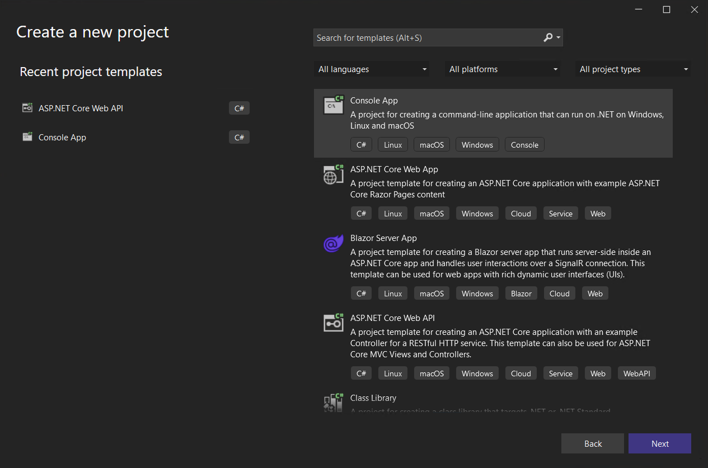
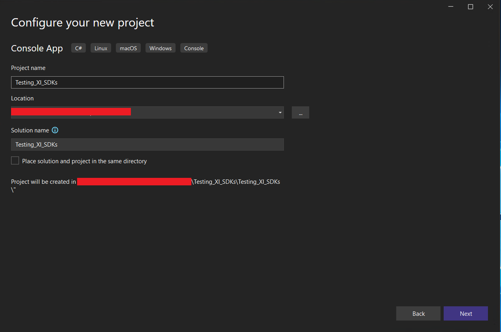
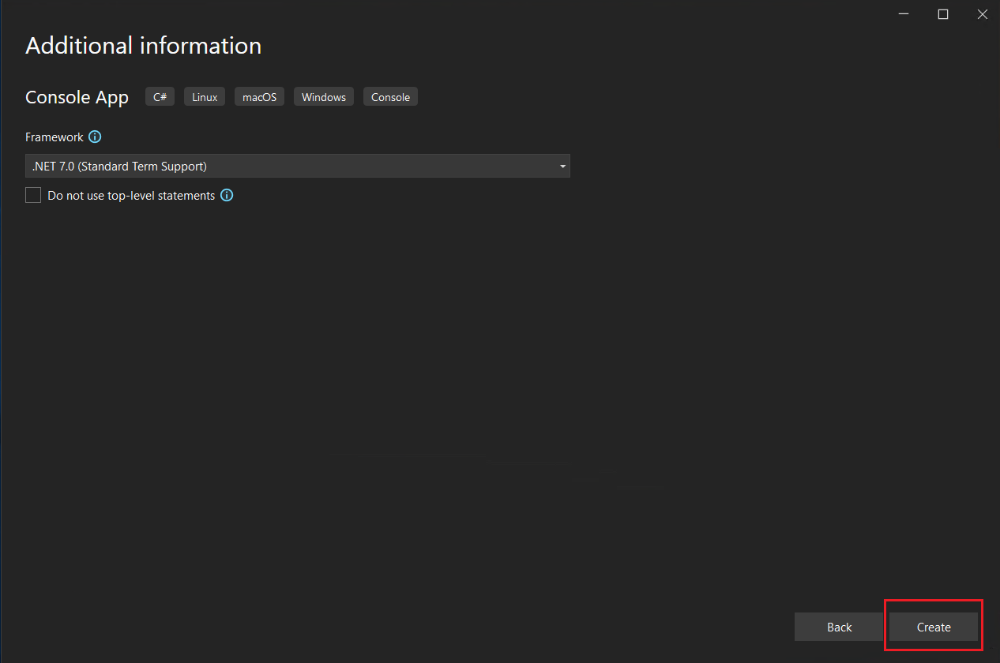
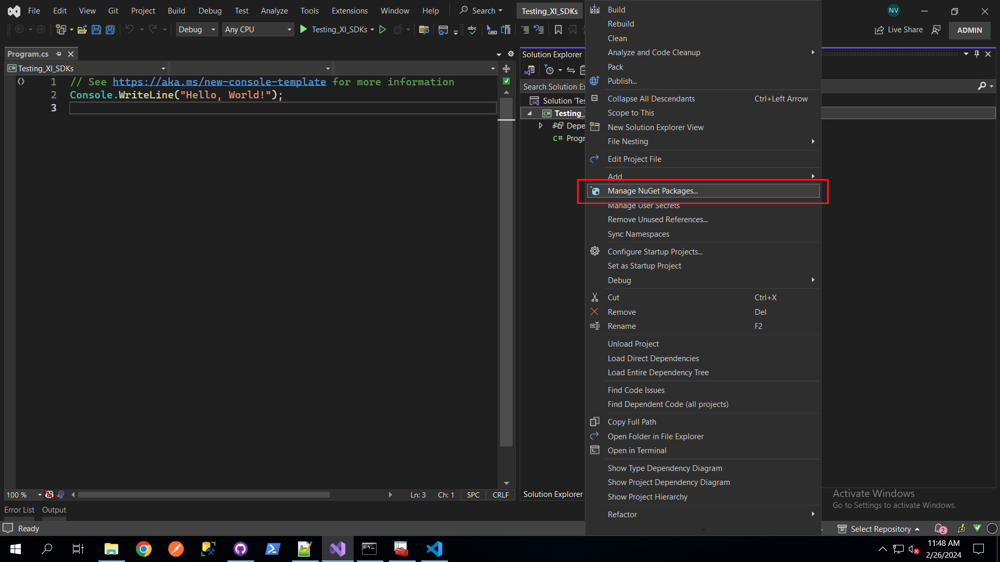
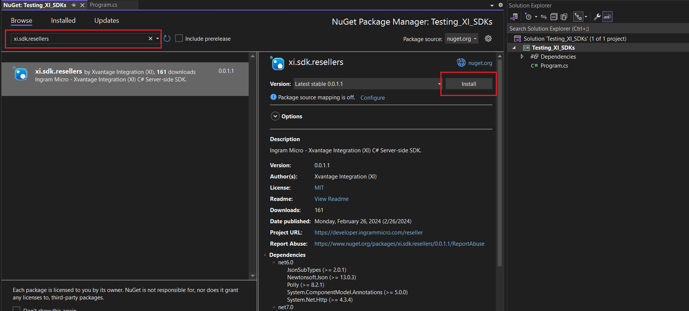
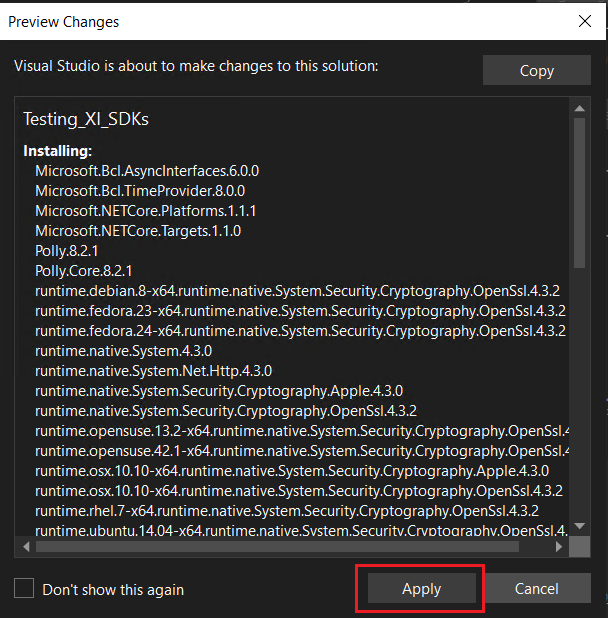
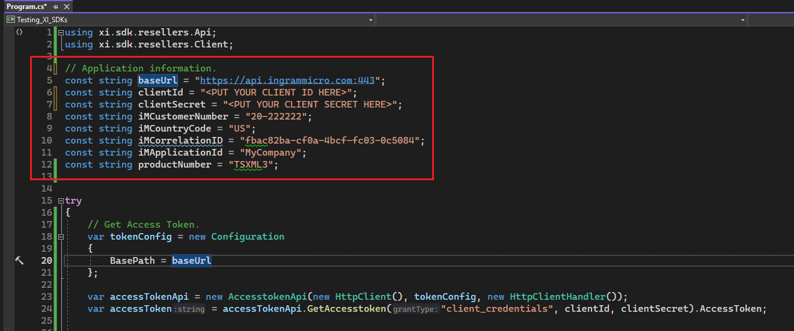
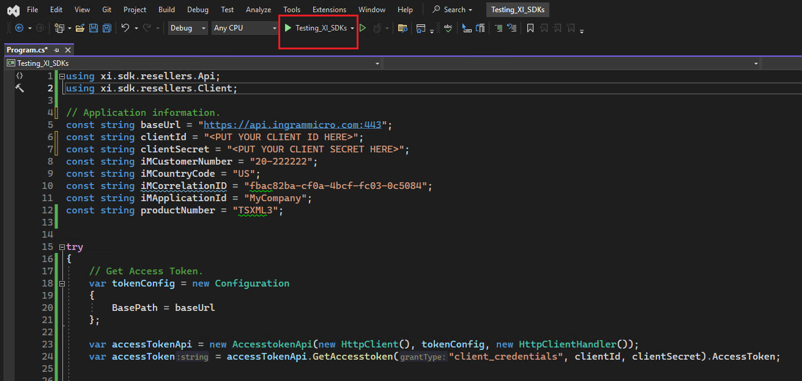
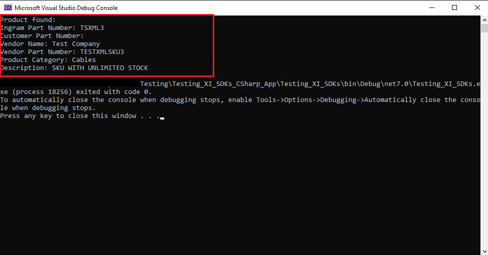

# XI SDK Quickstart for C#


[Repository GitHub](https://github.com/ingrammicro-xvantage/xi-sdk-openapispec)

[SDK document](https://github.com/ingrammicro-xvantage/xi-sdk-resellers-csharp/tree/main/docs)

### Step 1: Create a new Console application.

To create a new Console application. Open your visual studio and follow below steps. 

* Open Visual studio 2022 → Select “Create a new Project” → Select “Console App”


* Specify your project name, location and solution name.



* Select your prefer framework, then clicking the “Create” button at the right bottom corner.



### Step 2: Install XI SDK package and all dependencies to your project from Nuget


* Package name: xi.sdk.resellers
* Dependencies:
    * Newtonsoft.Json - 13.0.2 or later
    * JsonSubTypes - 1.8.0 or later
    * System.ComponentModel.Annotations - 5.0.0 or later

Install packages using the Nuget package manager GUI:
* Right click on your project and Select “Manage Nuget Packages“



* Search for “xi.sdk.resellers” and click the “Install” button → Then click “Apply” button in the next dialog.





### Step 3: Write a simple code to access the access token and product details endpoints.

[Access Token API](https://github.com/ingrammicro-xvantage/xi-sdk-resellers-csharp/blob/main/docs/AccesstokenApi.md#getaccesstoken)

[Product API](https://github.com/ingrammicro-xvantage/xi-sdk-resellers-csharp/blob/main/docs/ProductCatalogApi.md)

* Open the Program.cs file and paste the following code. 

```csharp
using Newtonsoft.Json;
using System.Net.Http.Headers;
using xi.sdk.resellers.Api;
using xi.sdk.resellers.Client;

// Application information. Replace the following code with your own information.
const string baseUrl = "https://api.ingrammicro.com:443";
const string clientId = "<PUT YOUR CLIENT ID HERE>";
const string clientSecret = "<PUT YOUR CLIENT SECRET HERE>";
const string iMCustomerNumber = "20-222222";
const string iMCountryCode = "US";
const string iMCorrelationID = "fbac82ba-cf0a-4bcf-fc03-0c5084";
const string iMApplicationId = "MyCompany";
const string productNumber = "TSXML3";

try
{
    // Get Access Token.
    var tokenConfig = new Configuration
    {
        BasePath = baseUrl
    };

    var accessTokenApi = new AccesstokenApi(new HttpClient(), tokenConfig, new HttpClientHandler());
    var accessToken = accessTokenApi.GetAccesstoken("client_credentials", clientId, clientSecret).AccessToken;

    // Get a product information.
    var productApiConfig = new Configuration
    {
        BasePath = baseUrl,
        AccessToken = accessToken
    };
    var productApi = new ProductCatalogApi(new HttpClient(), productApiConfig, new HttpClientHandler());
    var product = productApi.GetResellerV6Productdetail(productNumber, iMCustomerNumber,
        iMCountryCode,
        iMCorrelationID, iMApplicationId);
    Console.WriteLine("Product found:");
    Console.WriteLine($"Ingram Part Number: {product.IngramPartNumber}");
    Console.WriteLine($"Customer Part Number: {product.CustomerPartNumber}");
    Console.WriteLine($"Vendor Name: {product.VendorName}");
    Console.WriteLine($"Vendor Part Number: {product.VendorPartNumber}");
    Console.WriteLine($"Product Category: {product.ProductCategory}");
    Console.WriteLine($"Description: {product.Description}");
}
catch (ApiException e)
{
    Console.WriteLine("Exception when calling ProductCatalogApi.GetResellerV6Productdetail: " + e.Message);
    Console.WriteLine("Status Code: " + e.ErrorCode);
    Console.WriteLine(e.StackTrace);
}

```

* Replace your application information at the below section in the code:
    * Client ID 
    * Client Secret.
    * Your IM customer number
    * Your country code
    * Your Correlation ID
    * Your Application ID
    * Product number to get the details.



### Step 4: Run the console application.



If everything is correct and the product exists, the console should return something like this.



 